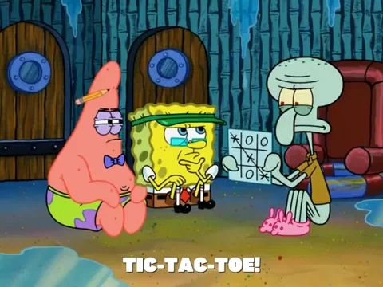

# taxi-rl


This repository contains the implementation of Sarsa, Q-learning algorithms for the Taxi environment, and multi-agent learning algorithms for repeated normal form games.

## Problem 1: Taxi Environment (Reinforcement Learning)
For Problem 1, two reinforcement learning algorithms were implemented to compute value functions and policies for the Taxi environment in OpenAI Gymnasium.

- **Part (a)**: Sarsa Algorithm (`taxi_sarsa.py`)
- **Part (b)**: Q-learning Algorithm (`taxi_qlearning.py`)

### Files Generated:
- `sarsa_q_vals.pickle`: Learned Q-values for the Sarsa algorithm.
- `sarsa_policy.pickle`: Policy actions derived from Sarsa.
- `sarsa_total_reward.png`: Total rewards per episode for Sarsa.

- `qlearning_q_vals.pickle`: Learned Q-values for the Q-learning algorithm.
- `qlearning_policy.pickle`: Policy actions derived from Q-learning.
- `qlearning_total_reward.png`: Total rewards per episode for Q-learning.

### How to Run:
To run the Sarsa and Q-learning algorithms, use the following commands:
```bash
python taxi_sarsa.py ε α γ
python taxi_qlearning.py ε α γ
```

### Example
```bash
python taxi_sarsa.py 0.1 0.6 0.9
python taxi_qlearning.py 0.1 0.6 0.9
```

## Problem 2: Multi-Agent Learning


The following multi-agent learning algorithms were implemented:

- Tit-for-Tat
- Fictitious Play
- Bully
- Godfather

### Files Generated:
- `multiagent_learning.py`: Contains the implementation of all the strategies.
- Tables with average rewards for all agents in different games (Prisoner's Dilemma, Chicken, Movie Coordination).

### How to Run:
Run the multi-agent learning simulation using:
```bash
python multiagent_learning.py
```